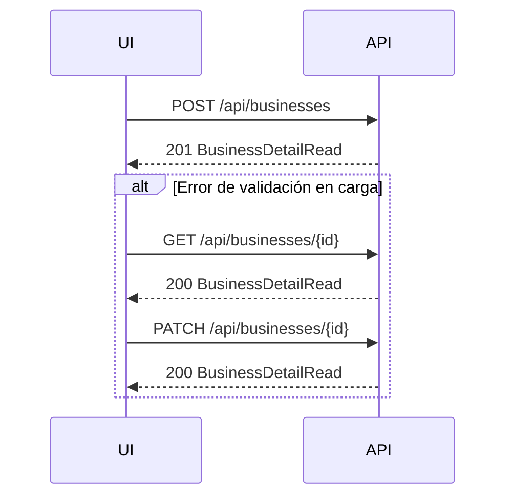

# API de negocios manuales (frontend)

Documentación de los endpoints que el frontend debe consumir para **crear**, **consultar** y **corregir** negocios cargados manualmente.

## Requisitos comunes

- **Autenticación:** sesión activa (cookie). Sin sesión → `401 unauthorized`.
- **CSRF:** en `POST` y `PATCH` enviar header `X-CSRF-Token` con el valor de la cookie `blf_csrf`.
- **Content-Type:** `application/json`.
- **Errores:** todas las respuestas de error usan el sobre estándar:

```json
{
  "error": {
    "code": "validation_error",
    "message": "Invalid request",
    "correlation_id": "uuid-o-id-de-seguimiento",
    "details": ["campo inválido..."]
  }
}
```

---

## Crear negocio manual

**`POST /api/businesses`**

Crea un lead con `source: "manual"`. El backend clasifica `website` / `has_website` en servidor (no enviar `has_website` desde el cliente).

### Request body

| Campo | Tipo | Requerido | Notas |
|-------|------|-----------|-------|
| `name` | `string` | sí | Máx. 160 caracteres |
| `category` | `string \| null` | no | Máx. 120 |
| `email` | `string \| null` | no | Email válido, normalizado a minúsculas |
| `phone` | `string \| null` | no | Máx. 40 |
| `social_links` | `string[]` | no | URLs `http/https`, máx. 10 |
| `website` | `string \| null` | no | Página propia; redes/directorios se descartan como sitio |
| `notes` | `string \| null` | no | Máx. 2000 |
| `address` | `string \| null` | no | Máx. 500; usada para deduplicación |

### Ejemplo

```json
{
  "name": "Clínica Dental Centro",
  "category": "Dentist",
  "email": "contacto@clinica.example",
  "phone": "+54 11 5555 1234",
  "social_links": [
    "https://instagram.com/clinicadentalcentro",
    "https://facebook.com/clinicadentalcentro"
  ],
  "website": null,
  "notes": "Referido por cliente",
  "address": "Av. Corrientes 1234, Buenos Aires"
}
```

### Respuesta exitosa

- **Status:** `201 Created`
- **Body:** `BusinessDetailRead` (ver contrato abajo)

### Errores relevantes

| Status | `error.code` | Cuándo |
|--------|--------------|--------|
| `400` | `validation_error` | Payload inválido |
| `400` | `invalid_json` | JSON malformado |
| `409` | `conflict_error` | Ya existe negocio manual con mismo nombre + dirección |
| `403` | `forbidden` | CSRF inválido |
| `500` | `database_error` | Fallo de persistencia |

---

## Consultar detalle (formulario de edición)

**`GET /api/businesses/{id}`**

Devuelve el negocio completo para poblar el formulario de corrección.

### Respuesta exitosa

- **Status:** `200 OK`
- **Body:** `BusinessDetailRead`

### Errores

| Status | `error.code` | Cuándo |
|--------|--------------|--------|
| `400` | `validation_error` | `id` no es UUID |
| `404` | `not_found` | Negocio inexistente |

---

## Editar negocio (corrección post-alta)

**`PATCH /api/businesses/{id}`**

Actualización **parcial**: enviar solo los campos a corregir. Al menos un campo es obligatorio.

### Campos editables

| Campo | Tipo | Alcance |
|-------|------|---------|
| `name` | `string` | solo `source === "manual"` |
| `category` | `string \| null` | solo manual |
| `email` | `string \| null` | solo manual |
| `phone` | `string \| null` | solo manual |
| `social_links` | `string[] \| null` | solo manual; `null` o `[]` limpia |
| `website` | `string \| null` | solo manual; reclasifica `has_website` en servidor |
| `address` | `string \| null` | solo manual |
| `notes` | `string \| null` | cualquier negocio |
| `status` | `LeadStatus` | cualquier negocio (`new`, `reviewed`, `contacted`, `discarded`) |

### Ejemplo: corregir email y redes

```json
{
  "email": "nuevo@clinica.example",
  "social_links": [
    "https://instagram.com/clinica",
    "https://facebook.com/clinica"
  ]
}
```

### Ejemplo: corregir varios campos tras error de carga

```json
{
  "name": "Clínica Dental Centro",
  "phone": "+54 11 5555 9999",
  "website": "https://clinicacentro.example",
  "notes": "Teléfono corregido",
  "status": "reviewed"
}
```

### Respuesta exitosa

- **Status:** `200 OK`
- **Body:** `BusinessDetailRead` actualizado

### Errores relevantes

| Status | `error.code` | Cuándo |
|--------|--------------|--------|
| `400` | `validation_error` | Payload vacío o campos inválidos |
| `403` | `forbidden` | Intento de editar perfil en negocio `google_places` |
| `404` | `not_found` | ID inexistente |
| `409` | `conflict_error` | Nombre + dirección duplican otro negocio manual |

---

## Contrato `BusinessDetailRead`

Campos que el frontend debe mostrar/guardar:

```typescript
interface BusinessDetailRead {
  id: string;
  name: string;
  category: string | null;
  address: string | null;
  city: string | null;
  phone: string | null;
  email: string | null;
  social_links: string[];
  website: string | null;
  has_website: boolean;       // solo lectura; derivado en backend
  status: "new" | "reviewed" | "contacted" | "discarded";
  maps_url: string | null;
  search_run_id: string | null;
  external_id: string | null;
  source: "google_places" | "manual";
  region: string | null;
  country: string | null;
  lat: number | null;
  lng: number | null;
  notes: string | null;
  opportunity_selected: boolean;
  created_at: string;         // ISO 8601
  updated_at: string;         // ISO 8601
}
```

### Reglas de dominio para la UI

1. **`has_website`:** no calcular en frontend; mostrar según respuesta del API.
2. **`website` vs `social_links`:** Instagram/Facebook/WhatsApp van en `social_links`, no en `website`.
3. **Oportunidades:** si `has_website === false`, el backend garantiza fila en `opportunities` (el lead aparece en el tablero según reglas existentes).
4. **Negocios ingestados (`google_places`):** el PATCH de perfil devuelve `403`; solo `status` y `notes` son editables.
5. **Listado:** `GET /api/businesses` también devuelve `email` y `social_links` en cada ítem (`BusinessRead`).

---

## Listado paginado (referencia)

**`GET /api/businesses?page=1&page_size=20`**

Útil para pantallas de listado. Los filtros existentes (`has_website`, `status`, `city`, `category`, `query`, `order_by`) no cambian.

---

## Flujo recomendado en frontend



1. Formulario de alta → `POST /api/businesses`.
2. Si el usuario abre el detalle para corregir → `GET /api/businesses/{id}`.
3. Guardar cambios parciales → `PATCH /api/businesses/{id}` con solo los campos modificados.
